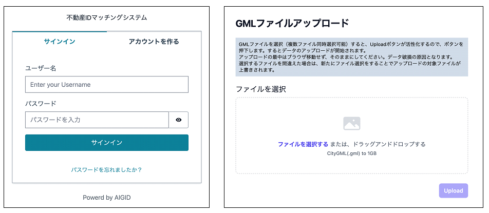

# 不動産IDマッチングシステム 

 

## 1. 概要
本リポジトリでは、2023年度のProject PLATEAUで開発した「不動産IDマッチングシステム」のソースコードを公開しています。

「不動産IDマッチングシステム」は、不動産登記及び登記所備付地図を活用し、PLATEAUの3D都市モデルの建築物データに、建物の不動産ID、区分所有の不動産ID、土地の不動産IDを付与するシステムです。

## 2. 「不動産IDマッチングシステム」について
「不動産IDマッチングシステム」は、3D都市モデルを介して不動産IDに紐づけられた様々な建物情報の利活用を促進することを目的として開発しました。本システムは、不動産登記情報及び登記所備付地図からマッチング用の不動産IDを算出する「不動産ID空間データ構築環境」と、PLATEAUの3D都市モデルの建築物データに不動産IDを付与する「不動産IDマッチングサービス環境」を実装しています。

本システムは、一般ユーザ向けのGUIを備えたオープンソースソフトウェアとしてフルスクラッチで開発されています。
本システムの詳細については[技術検証レポート](https://www.mlit.go.jp/plateau/file/libraries/doc/XXXX)を参照してください。

## 3. 利用手順
本システムの構築手順及び利用手順については[利用チュートリアル](https://project-plateau.github.io/RealEstateID-matching-system/)を参照してください。  
※本システムは不動産番号、所在地、家屋番号、地番などの不動産登記の情報をデータ化した「不動産登記データ」及び[「法務省登記所備付地図」](https://front.geospatial.jp/moj-chizu-xml-download/)の利用を前提としています。  

## 4. システム概要
### 【不動産ID空間データ構築環境】
#### ①登記所備付地図データ登録機能
- 登記所備付地図（14条地図）データ（GeoJSON形式）を読み込み、筆を示す一意のコードである「筆コード」と筆ポリゴンの代表点を生成します。
- 筆コード、筆の所在地（地番）、代表点及びポリゴンを「筆ポリゴンデータ」テーブルに格納します。

#### ②ジオコーダ用辞書作成機能
- PostGISの「筆ポリゴンデータ」テーブルを読み込み、地番を含む所在地表記をジオコーディングした場合に筆コードを返すジオコーダ用辞書データを作成します。

#### ③合筆履歴解析機能
- 不動産登記土地データ（CSV）に含まれる変更履歴から合筆情報を抽出し、合筆前の地番が登記所備付地図に収録されていない場合に、合筆後の地番の筆コードを返すようにジオコーダ用辞書を拡張します。

#### ④土地不動産ID付与機能　
- 不動産登記土地データ（CSV）から所在地（地番）に対応する不動産番号を取得し、地番に対応する「筆ポリゴンデータ」のレコードに、不動産番号から生成した土地不動産IDを付与します。

#### ⑤建物データ生成機能
- 不動産登記建物データ（CSV）から建物情報を取得し、区分所有建物（以下「区建」という。）の場合には建物全体が1つのレコードになるように集約して「建物データ」テーブルに格納します。
- 個別の不動産番号から建物個別の不動産IDを算出し、建物に含まれる不動産IDを管理する「不動産ID対応データ」テーブルに格納します。

#### ⑥建物所在地展開・筆コード付与機能
- 「建物データ」テーブルの各レコードに対して、所在地に含まれる地番リストを展開した「建物所在地データ」テーブルを作成します。
- 各地番にはジオコーディングによって筆コードを付与します。

#### ⑦建物データ属性更新機能
- 「建物データ」テーブルの各レコードに対して、床面積の合計、階高、地番リストに含まれる筆ポリゴンを結合した領域を算出して登録します。
- 区建の場合は建物全体の不動産IDを登録します。

### 【不動産IDマッチングサービス環境】
#### ⑧ID・パスワード発行機能
- データ登録を行うためのID・パスワードを発行します。

#### ⑨データ登録機能
- 登録されたデータが、3D都市モデルの建築物データであることを確認し、正しい場合にはリクエストをキューイングします。

#### ⑩建築物マッチング機能
- 3D都市モデルの建築物データの接地面図形（LOD0）と建物データを空間演算により重ね合わせ、マッチング結果をPostGISのテーブルに格納します。

#### ⑪CityGML更新機能
- マッチング結果をもとに3D都市モデルの建築物データに不動産IDを付与し、出力します。

## 5. 利用技術

| 種別              | 名称   | バージョン | 内容 |
| ----------------- | --------|-------------|-----------------------------|
| ライブラリ        | [AWSboto3](https://aws.amazon.com/jp/sdk-for-python/) | 3 | PythonからAWSの各種サービスを利用するためのライブラリ |
|       | [GDAL(ogr2ogr)](https://gdal.org/) | 3.8.3 | CityGMLファイルの解析とPostGISデータの投入用のライブラリ |
|       | [GEOS](https://libgeos.org/) | 3.1.0 | 地理空間情報を処理するためのライブラリ（Geometry Engine Open Source） |
|       | [Jageocoder](https://www.info-proto.com/jageocoder/) | 2.0.0 | 住所ジオコーダライブラリ（不動産登記情報における建物所在地を登記所備付地図と突合するために使用） |
|       | [PostGIS](https://postgis.net/) | 15.3.3 | リレーショナルデータベースPostgreSQLに地理空間データの管理機能を拡張するためのライブラリ |
|       | [Proj4](https://proj.org/) | 4.5.0 | 空間参照系変換ライブラリ |
|       | [Psycopg2](https://pypi.org/project/psycopg2/) | 2.9.9 | SQLデータベースをPythonで利用するためのライブラリ（PostGISにアクセスするために使用） |
|       | [Psycopg3](https://www.psycopg.org/psycopg3/) | 3.1 | PythonでデータベースPostGISに接続し、SQLを発行するためのライブラリ |
|       | [Python標準ライブラリ](https://www.python.jp/) | 3.8.10 | Pythonとともに配付されている標準ライブラリ |
|       | [fastapi](https://fastapi.tiangolo.com/) | 0.100.1 | CityGMLファイルのアップロードの機能を提供するために利用したWebフレームワーク |
|       | [install](https://pypi.org/project/install/) | 1.3.5 | PIPパッケージのインストール用ライブラリ |
|       | [jmespath](https://pypi.org/project/jmespath/) | 1.0.1 | JSONから必要な情報をフィルタリングするJMESPath記法を用いるためのライブラリ |
|       | [lxml](https://pypi.org/project/lxml/) | 5.1.0 | PythonでCityGML等のXMLについて解析・要素追加・値の加工等を行うためのXML操作ライブラリ |
|       | [mangum](https://pypi.org/project/mangum/) | 0.17.0 | FastAPIのアプリケーションをAWSLambdaで動かすためのインタフェースを提供するGlueライブラリ |
|       | [Pillow](https://pypi.org/project/pillow/) | 9.0.1 | Pythonで簡単な画像処理を行うためのライブラリ |
|       | [psycopg2-binary](https://pypi.org/project/psycopg2/) | 2.9.9 | PythonからPostgreSQL（PostGIS）にアクセスするためのDB接続用ライブラリ |
|       | [pydantic-settings](https://pypi.org/project/pydantic-settings/) | 2.0.2 | FastAPIのアプリケーションからパラメータ類をクラスとして扱うために利用するPydanticライブラリ |
|       | [python-dateutil](https://pypi.org/project/python-dateutil/) | 2.8.2 | Pythonで日付情報を簡単に扱うためのユーティリティライブラリ |
|       | [python-dotenv](https://pypi.org/project/python-dotenv/) | 1.0.0 | Pythonで.env環境変数定義ファイルを扱うために利用するユーティリティライブラリ |
|       | [pytz](https://pypi.org/project/pytz/) | 2023.3.post1 | Pythonから日付のタイムゾーン情報を簡単に扱うために利用するユーティリティライブラリ |
|       | [requests](https://pypi.org/project/requests3/) | 2.31.0 | Pythonで簡易的に利用できるヘッドレスブラウザ機能を提供するライブラリ |
|       | [s3transfer](https://pypi.org/project/s3transfer/) | 0.10.0 | PythonからAWSS3バケットの情報を扱うためのライブラリ。AWSboto3に含まれる。 |
|       | [six](https://pypi.org/project/six/) | 1.16.0 | Python2とPython3の互換性を保つために利用されるライブラリ。導入ライブラリの一部の古い処理を動かすために利用されている。 |
|       | [urllib3](https://pypi.org/project/urllib3/) | 2.0.7 | requestsライブラリが内部的に利用しているURL処理用ライブラリ |
| フレームワーク    | [vue](https://ja.vuejs.org/) | 3.3.4 | Webユーザーインターフェース構築のためのフレームワーク |

## 6. 動作環境 <!-- 動作環境についての仕様を記載ください。 -->
| 項目               | 最小動作環境                 | 推奨動作環境  | 
| ------------------ | ---------------------------- | ------------- | 
| OS                 | Docker Desktop または Engine | Docker Engine | 
| CPU                | X64 または Apple m1          | X64           | 
| メモリ             | 2GB                          | 8GB           | 
| ディスプレイ解像度 | -                            | -             | 
| ネットワーク       | 1Mbps                        | 10Mbps        | 

## 7. 本リポジトリのフォルダ構成 <!-- 本GitHub上のソースファイルの構成を記載ください。 -->
| フォルダ名 | 詳細                                                      |
|------------|-----------------------------------------------------------|
| dbbuild    | 不動産ID空間データ構築環境 |
| dbbuild/sample | 構築用サンプルファイル |
| matching   | 不動産IDマッチングサービス環境                            |

## 8. ライセンス <!-- 変更せず、そのまま使うこと。 -->

- ソースコード及び関連ドキュメントの著作権は国土交通省に帰属します。
- 本ドキュメントは[Project PLATEAUのサイトポリシー](https://www.mlit.go.jp/plateau/site-policy/)（CCBY4.0及び政府標準利用規約2.0）に従い提供されています。

## 9. 注意事項 <!-- 変更せず、そのまま使うこと。 -->

- 本リポジトリは参考資料として提供しているものです。動作保証は行っていません。
- 本リポジトリについては予告なく変更又は削除をする可能性があります。
- 本リポジトリの利用により生じた損失及び損害等について、国土交通省はいかなる責任も負わないものとします。

## 10. 参考資料 <!-- 技術検証レポートのURLはアクセンチュアにて記載します。 -->
- 技術検証レポート: http://XXXX
- PLATEAU WebサイトのUse Caseページ「3D都市モデル・不動産IDマッチングシステム」: https://www.mlit.go.jp/plateau/use-case/dt23-03/
