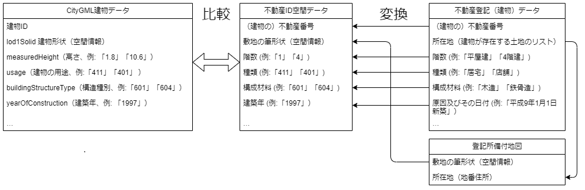

# データ構築環境作成
「不動産IDマッチングシステム」で利用するマッチングのためのデータ「不動産ID空間データ」の作り方について説明します。  
なお、データ作成に利用する「不動産登記データ」は非公開のため、個人情報等を含まないダミーデータをサンプルとして収録しています。

## 「不動産ID空間データ」とは
不動産IDマッチングシステムは、3D都市モデルの建築物データに含まれる建物形状、高さ、建物構造などの情報と、不動産登記データに含まれる床面積や階数などの情報を比較し、最も一致する率の高い不動産登記の「不動産番号」をもとに建物の不動産IDを計算します。  
また、建物データの座標と不動産登記データの所在地の座標が一致していることを確認するため、登記所備付地図を利用して所在地に対応する座標の範囲（ポリゴン）を求めています。  
この処理を高速に行うために、不動産登記データと登記所備付地図を、地理情報を管理できるリレーショナルデータベース（PostGIS）に検索可能な形で登録した空間データベースを作成しておく必要があります。  
このデータベースを「不動産ID空間データ」と呼んでいます。

これ以降で説明するのは、下図右側の「変換」に当たる処理を行い、入力データから不動産ID空間データを作成する手順です。

## 必要なデータセット
不動産ID空間データを作成するには、対象とする地域の以下のデータが必要です。  
不動産登記（建物・土地）データはCSV形式、登記所備付地図データは、GeoJSON形式のものを用意してください。

- 不動産登記（建物）データ  
不動産登記（建物）データには、建物の不動産番号のほか、建物の面積や階数、用途種別などマッチングに最も必要な情報が含まれています。

- 不動産登記（土地）データ  
不動産登記（土地）データは上の図では省略していますが、土地の分筆や合筆の履歴、土地の不動産番号が含まれています。  
建物の新築時の登記に記載されている所在地は登記時点のものであり、それ以降に他の土地と合筆された場合には現存しないことがあります。  
登記時点の所在地記載を現在の所在地に変換するため、土地の履歴を利用する必要があります。  
また、分譲マンションなどの区分所有建物の不動産IDは「土地の不動産番号」から計算すると決められているため、そこでも土地の登記データを利用します。

- 登記所備付地図データ  
登記所備付地図データは、不動産登記（建物）データと不動産登記（土地）データに含まれる所在地に対応する座標を計算するために利用します。

## 「不動産ID空間データ」作成手順

- Docker環境構築  
データ作成にはPostGISやGDAL、Pythonなどが必要ですが、Dockerを利用すると環境構築を自動的に行うことができます。
使用するOSに合わせて<a href="https://docs.docker.com/get-docker/">Docker DesktopまたはDocker Engineをインストール</a>してください。

- PostGIS起動  
不動産ID空間データはPostGIS上に構築されるため、まずはPostGISをバックグランド（ディタッチドモード）で起動してください。  

        $ docker compose up -d postgis_realestate

- 入力データファイルを配置

    inputディレクトリに入力データファイルを配置します。

    サンプルデータを利用する場合は、sampleディレクトリの下にある `37201_dummy_tatemono.csv.gz`、`37201_dummy_tochi.csv.gz`、`37201_sample.geojson.gz`の3ファイルをinputディレクトリにコピーしてください。

        $ cp sample/*.gz input/
        
    - 不動産登記（建物）データのファイル名は必ず`*_tatemono*.csv.gz`にマッチする必要があります（*はワイルドカード）。ファイルフォーマットはCSVをgzipで圧縮してください。

    - 不動産登記（土地）データのファイル名は必ず`*_tochi*.csv.gz`にマッチする必要があります（*はワイルドカード）。ファイルフォーマットはCSVをgzipで圧縮してください。

    - 登記所備付地図データのファイル名は必ず`*.geojson.gz`にマッチする必要があります（*はワイルドカード）。ファイルフォーマットはGeoJSONをgzipで圧縮してください。
    
- データ作成スクリプトを実行

    realestate_id_dbサービスを実行すると作成処理を実行します。
    
        $ docker compose run --rm realestate_id_db
    
    正常に処理が完了すると`work/realestate_id_db-YYYYMMDD_hhmmss.dump.gz`に不動産ID空間データをすべて含むPostGISダンプファイルが生成されます。なお、YYYYMMDDは処理を開始した年月日、hhmmssは時分秒です。

    このダンプファイルをマッチングシステムのPostGISに読み込めば、3次元都市モデルの建物ポリゴンとのマッチングを行うことができます。

- 作業用Dockerコンテナ・イメージの削除

    作業が終わり、それ以降はデータ作成用のDockerコンテナを利用しない場合は、以下のコマンドにより作成したコンテナを削除します。

        $ docker compose down -v

    また、イメージも不要であれば削除して構いません。

        $ docker rmi postgis_realestate
        $ docker rmi realestate_id_db

不動産ID空間データを作成する手順は以上です。
